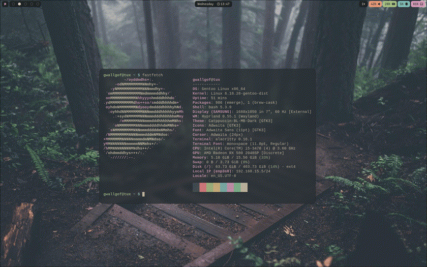

<h1 align="center">Gwall's Dots</h1>

  

<h2>Details:</h2>

- WM: Hyprland
- Terminal Emulator: Alacritty
- Bar: Waybar
- App Launcher/Others: Rofi

<h2>Overview</h2>

Simple yet good looking dotfiles, mainly for personal use, including a theme swicther made with rofi and bash scripts

The theme swicther includes the following colorschemes:

- Catppuccin
- Nordic/Nord
- Rosé Pine
- Everforest
- Tokyo Night
- Tokyo Night Dark Enhanced
- Kanagawa
- Gruvbox
- Monokai
- Osaka/Solarized
- Monochrome
- Gotham

more to be added in the future

It also includes a waybar theme swicther, including the following modes:

- Floating
- Simple
- Dock

<h2>Additional notes</h2>

For now, the script only swtiches to the correct colorscheme wallpaper if the wallpapers folder (the one in this repo) is located in /home/user/Pictures/wallpapers/

I'll try to improve this, but for now you'll have to place the wallpapers folder in that location if you want the wallpaper switcher to work (or you could just modify the script)

For the GTK and Icon theme switcher to work, you'll have to install the gtk themes and icons themes manually

The themes that I used:

https://www.gnome-look.org/s/Gnome/p/1715554
https://www.gnome-look.org/p/1695467
https://www.gnome-look.org/p/1681313/
https://www.gnome-look.org/p/1810560/
https://bitbucket.org/dirn-typo/yet-another-monochrome-icon-set/src/main/
https://www.gnome-look.org/p/1695467/
https://www.gnome-look.org/p/2284009/
https://github.com/EliverLara/Nordic
https://github.com/avivace/monokai-gtk
https://github.com/EliverLara/Kripton
https://github.com/ljmill/catppuccin-icons
https://github.com/ljmill/tokyo-night-icons
https://store.kde.org/s/KDE%20Store/p/1961046
https://github.com/Fausto-Korpsvart/Nordzy-icon
https://www.gnome-look.org/p/1681460
https://www.gnome-look.org/p/1695476
https://www.gnome-look.org/p/1810565
https://www.gnome-look.org/p/1810549

Once I imporve how the theme swicher is structured, I'll add the option to disable GTK/Icon theme swicthing, aswell not having to place the wallpapers folder in that specific directory

<h1>TODO</h1>

- Add pywall/matugen theme
- Add hyprlock theme
- Add more wallpapers
- Add SDDM theme
- Improve Rofi theme
- Optimize the theme swicther itself
